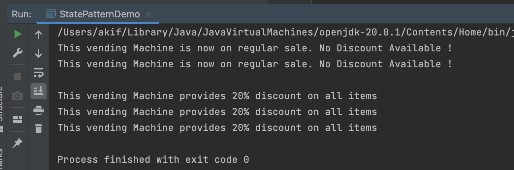

# A demonstration of State Design Pattern

# Course Title : Object Oriented Design and Design Patterns Lab(CSE 4122)
## Author
Akif Islam<br>
Department of CSE, University of Rajshahi<br>
iamakifislam@gmail.com<br><br><br>

## Experiment 07
<p>Write a Java program to demonstrate the implementation of a state design pattern for a vending machine functionality on purchasing items.</p>


## Class Diagram

(will be added soon)


## How to Run?
```bash
  $javac StatePatternDemo.java
  $java StatePatternDemo
```


## State Pattern Demo Program
```java
VendingMachineState stateContext = new VendingMachineState();
stateContext.showState();
stateContext.showState();

System.out.println();

stateContext.setState(new DiscountSale());
stateContext.showState();
stateContext.showState();
stateContext.showState();

```

## Output



